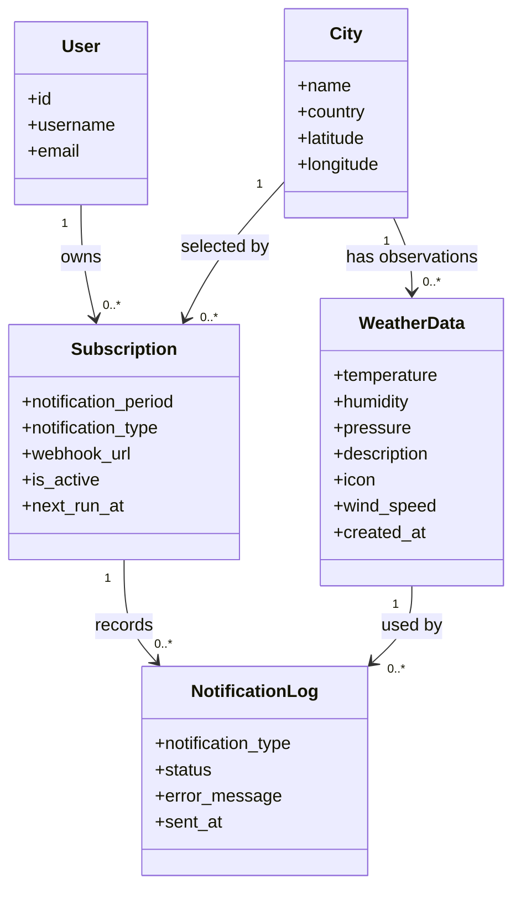
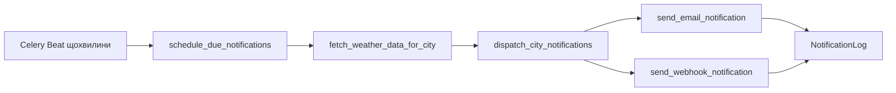

# Структура DjangoWeatherReminder

Проєкт складається з пакета конфігурації Django та трьох предметних apps. Окремої папки `apps/` немає: вона лише повторювала факт, що `weather`, `subscriptions` і `accounts` уже є Django apps.

```text
weather_reminder/       налаштування Django, кореневі URL, Celery, ASGI/WSGI
accounts/               реєстрація користувача
weather/                міста, дані погоди, OpenWeatherMap, погодні задачі
subscriptions/          підписки, розклад, email/webhook і журнал доставки
tests/                  наскрізні тести HTTP API та моделей
docs/                   пояснення архітектури та розкладу
manage.py               команда запуску Django
docker-compose.yml      локальні web, PostgreSQL, Redis, worker і Beat
```

## UML: моделі даних



`User` — стандартна модель Django. `City` та `WeatherData` визначені в `weather/models.py`; `Subscription` та `NotificationLog` — у `subscriptions/models.py`. Підписка допускає періоди 1, 3, 6 або 12 годин і канали email, webhook або обидва. Значення `next_run_at` зберігає наступний час постановки в чергу, а не час успішної доставки.

## Призначення модулів

| Модуль | Відповідальність |
| --- | --- |
| `accounts/serializers.py`, `accounts/views.py`, `accounts/urls.py` | Перевірка даних та HTTP-реєстрація; JWT endpoints підключені в кореневих URL. |
| `weather/models.py`, `weather/serializers.py`, `weather/views.py`, `weather/urls.py` | Зберігання міст і погоди, читання списку міст, пошук та отримання погоди через API. |
| `weather/openweather.py` | Одна типізована функція для HTTP-запиту до OpenWeatherMap; не знає про Celery або підписки. |
| `weather/tasks.py` | Отримання/кешування погоди та видалення старих погодних записів. |
| `subscriptions/models.py`, `subscriptions/serializers.py`, `subscriptions/views.py`, `subscriptions/urls.py` | CRUD підписок, перевірка webhook URL та читання журналу свого користувача. Видалення підписки — стандартний `DELETE` з DRF `ModelViewSet`. |
| `subscriptions/scheduling.py` | Вибір підписок, яким настав час, групування за містом та оновлення розкладу в транзакції. Функція отримує публікатор аргументом. |
| `subscriptions/tasks/notifications.py` | Ланцюжок «отримати погоду → визначити канали» та запуск за розкладом. |
| `subscriptions/tasks/email.py`, `webhook.py` | Незалежна доставка кожним каналом і запис результату в `NotificationLog`. |
| `subscriptions/templates/subscriptions/` | Текстова та HTML-версії одного email; локально обидві виводяться консольним backend у лог worker. |
| `subscriptions/management/commands/populate_data.py` | Створення демонстраційних міст, користувачів і підписок. Демонстраційні webhook-підписки неактивні до встановлення справжнього URL. |
| `weather_reminder/settings.py`, `urls.py`, `celery.py` | Збірка Django, маршрути JWT/API та розклад Celery Beat. |

`apps.py` у кожному Django app містить лише `AppConfig` для реєстрації app. `admin.py` лише налаштовує відображення моделей у Django admin. Тому тут немає окремих «service», «repository» або «manager» шарів без потреби: HTTP-запит винесений окремо, бо це зовнішня залежність, а планувальник приймає функцію публікації для ізоляції від Celery.

## Потік повідомлення



Свіжа погода за останні 30 хвилин береться з БД; інакше `fetch_current_weather` звертається до OpenWeatherMap. Доставка відбувається окремими задачами за каналами. Додаткові деталі паралельного планування описані в [notification-scheduling.md](notification-scheduling.md).

## Чому немає окремого `weather_app`

Перші міграції були записані в БД з Django label `weather_app`. Тепер їхні файли лежать у `weather/migrations/`, а `WeatherConfig.label = "weather_app"` зберігає цей ідентифікатор. Це дозволяє прибрати стару папку без повторного створення чи видалення таблиць. Таблиці залишаються `weather_app_*`; `subscriptions` приймає свої таблиці через state-only міграцію. Celery використовує звичайні імена модулів `weather.tasks.*` і `subscriptions.tasks.*`.

На базі, яка вже пройшла попередній етап рефакторингу, `weather.0004` повертає `ContentType` міста й погоди до збереженого label. Міграція зміни доступних періодів не переписує наявні підписки з періодом 2 години: їх треба відредагувати окремо, щоб не змінити графік користувача мовчки.

## Перевірка локально

`docker compose up -d --build` запускає PostgreSQL, Redis, Django, Celery worker і Beat. На PostgreSQL проходять 38 тестів. Окремо перевірено живу відповідь OpenWeatherMap і два локальні шляхи через Redis/Celery: HTTP webhook до тимчасового приймача та email у консоль worker. Віддалене розгортання сюди не входить.
