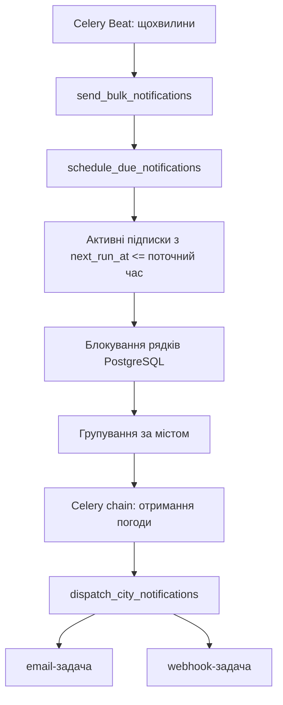

# Періодична розсилка

Celery Beat щохвилини запускає `send_bulk_notifications`. Це частота перевірки,
а інтервал конкретної підписки задає `notification_period`: 1, 3, 6 або 12 годин.



## Розклад

`Subscription.next_run_at` — час, коли підписку можна знову поставити в чергу.
Початкове значення — час створення підписки, тому перше повідомлення
планується під час найближчої перевірки Beat.

Після постановки в чергу наступний час дорівнює поточному часу плюс
`notification_period` годин. Після тривалого простою пропущені повідомлення
не надсилаються пачкою: планується одне актуальне повідомлення.

Зміна періоду застосовується під час наступного планування; вже записаний
`next_run_at` автоматично не перераховується. Неактивні підписки пропускаються.

## Функції

- `schedule_due_notifications(publish)` відбирає готові підписки,
  групує їх за містом, викликає передану функцію публікації та оновлює розклад.
  `publish` передається аргументом, тому сервіс не залежить від Celery.
- `subscriptions.tasks.notifications.publish_city_notifications(city_id, subscription_ids)` створює ланцюжок
  отримання погоди й подальшого вибору каналів повідомлень.
- `subscriptions.tasks.notifications.dispatch_city_notifications(weather_data_id, subscription_ids)` отримує
  ID погоди з попередньої задачі та ставить у чергу email, webhook або обидва.
  Повторно перевіряє активність і місто підписки.
- `send_bulk_notifications()` запускає планування для всіх користувачів.

## Паралельні запуски та обмеження

`transaction.atomic()` і `select_for_update(skip_locked=True)` утримують
блокування відібраних рядків до завершення планування. Другий планувальник
пропускає ці рядки. Цей захист перевіряється на PostgreSQL; SQLite не надає
еквівалентного блокування рядків.

Публікація виконується в межах транзакції: якщо брокер одразу повертає помилку,
час наступного запуску не зберігається. Але PostgreSQL і Redis не мають спільної
транзакції. Якщо частина повідомлень уже опублікована, а наступна публікація
або commit не вдається, повторне планування може створити дубль. Це не гарантія
доставки рівно один раз при всіх збоях.

Розклад означає час постановки в чергу, а не підтверджене отримання листа.
Помилки отримання погоди або доставки поки не повертають підписку в поточний
цикл: наступна спроба відбудеться за її наступним розкладом. Окремі повторні
спроби доставки потребують наступної задачі.

## Перевірка

```powershell
docker compose exec web python manage.py test subscriptions.tests.test_notification_schedule
docker compose logs -f celery celery-beat
```

Тести перевіряють інтервали, групування, неактивні й майбутні підписки,
повторний запуск, помилку брокера та вибір каналів.
Локально email виводиться в лог worker через консольний backend.
